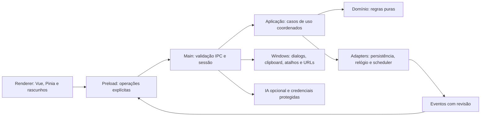

# Arquitetura proposta — TaskFlow App

**TFA-001 · revisão documental · 2026-10-03**

Este documento registra o baseline arquitetural aprovado na TFA-001 e, nas seções **Fundação TFA-002 implementada** e **Persistência e IPC de estado TFA-003 implementados**, os contratos que passaram a existir no aplicativo. O restante descreve contratos para as Changes futuras e não declara funcionalidades de tarefas, lixeira, lembretes, captura ou IA disponíveis.

## Estado das decisões

| Estado | Significado neste documento |
| --- | --- |
| **Aprovado** | Decisão confirmada pelo usuário ou baseline explicitamente aprovado nos artefatos da TFA-001. |
| **Proposto** | Desenho para orientar Changes futuras; precisa da validação indicada antes da implementação. |
| **Condicional** | Preferência que depende de prova técnica ou revisão na Change responsável. |
| **Pendente** | Escolha não tomada; não preencher por inferência. |
| **Observado** | Fato conferido no código/spec da origem no HEAD informado, sem executar testes ou builds. |

O usuário aprovou em 2026-10-03 os artefatos da TFA-001, conforme a evidência registrada em [docs/roadmap.md](roadmap.md). A autorização abrange este apply documental. Não aprova implementação funcional, resolução automática das decisões condicionais ou avanço para TFA-002.

## Contexto e origem

O produto-alvo é um app Windows autocontido e local-first. O gerenciamento principal funciona sem backend obrigatório, conta central, nuvem ou rede. A meta é instalação por usuário, sem exigir administrador ou instalar serviço de sistema; isso não garante autorização para executar o programa sob política corporativa.

A extensão consultada é somente leitura. HEAD observado em 2026-10-03: `a763e7a0d646c664ecd4f979528bc2c3589fa8c4`, igual ao hash usado na análise da TFA-001. A inspeção confirmou Vue 3, Pinia, TypeScript estrito, WXT/Manifest V3 e separação entre domínio/aplicação e adapters Chrome. Nenhum teste ou build foi executado na origem; a inspeção não comprova funcionamento desktop.

Referências da proposta: [proposal](../openspec/changes/archive/2026-10-03-definir-arquitetura-e-paridade-desktop/proposal.md), [design](../openspec/changes/archive/2026-10-03-definir-arquitetura-e-paridade-desktop/design.md), [tasks](../openspec/changes/archive/2026-10-03-definir-arquitetura-e-paridade-desktop/tasks.md) e [roadmap](roadmap.md). A matriz de regras e fontes está em [parity-matrix.md](parity-matrix.md); os níveis de prova futura estão em [test-strategy.md](test-strategy.md).

## D1 — Stack: Vue existente com Electron

| Critério | Vue 3 / Pinia + Electron | Quasar + Electron |
| --- | --- | --- |
| Reaproveitamento | Conserva domínio, aplicação, componentes Vue e CSS após revisão; substitui WXT e adapters Chrome. | Reaproveita domínio/aplicação; componentes Vue podem coexistir, mas converter para Q-components aumenta o trabalho. |
| Paridade visual e teclado | Mantém controles e comportamentos de foco observados enquanto adapta a superfície. | Exige comprovar equivalência de controles, dialogs, estilos e resets. |
| Ferramentas | Ainda será necessário configurar builds de main, preload e renderer e empacotamento. | CLI integra o modo Electron, mas IPC, persistência e segurança continuam sendo decisões explícitas. |
| Manutenção | Menos camada nova para a base atual; exige ownership claro do shell desktop. | Convenções e componentes adicionais só justificam a mudança se trouxerem benefício concreto. |
| Windows | Electron e instalador ainda precisam de provas reais. | O uso de Quasar não elimina as mesmas provas de Electron e instalador. |

**Aprovado:** Vue 3/Pinia existentes com Electron como baseline; manter o núcleo portável. A razão é reaproveitar interface e regras observadas, trocando a infraestrutura de plataforma. Não houve benchmark de tamanho, consumo ou velocidade. Quasar permanece alternativa; adotá-lo ou alterar o baseline exige benefício demonstrável, revisão de paridade e revisão da decisão antes da implementação.

**Resolvido na TFA-002 (2026-10-04):** versões fixadas no lockfile com engines/peers/licenças inventariados; `electron-vite 5` e `electron-builder 26.17.0` implementados com os gates reais. Nada foi herdado da extensão. Detalhes em [desktop-foundation-validation.md](desktop-foundation-validation.md).

Referências de tooling consultadas no design: [electron-vite](https://electron-vite.org/guide/) e [Quasar Electron](https://quasar.dev/quasar-cli-vite/developing-electron-apps/configuring-electron/). A integração do Quasar não demonstra benefício funcional para esta base.

## D2 — Fronteiras e ownership propostos

O diagrama é um contrato de responsabilidades proposto, não um grafo de módulos já criado.

| Fronteira | Responsabilidade proposta | Limites |
| --- | --- | --- |
| Domínio | Tarefas, validações, status, consultas, recorrência, subtarefas, lembretes, lixeira/desfazer e normalização da captura. | Sem import de Vue, Pinia, Electron, Node/filesystem ou rede. |
| Aplicação | Casos de uso e portas internas; coordena mutações duráveis, preparação/desfazer e lembretes. | Dependências como relógio, IDs, repositories, scheduler, notifier e provider entram por injeção. |
| Main | Composition root, escritor coordenado, sessões de superfície, tokens transitórios e recursos do sistema. | Executa a rede de IA fora da fila/transação de dados; revalida sessão e configuração ao concluir. |
| Preload | Bridge pequena e tipada, com wrappers por operação e subscriptions que retornam `unsubscribe`. | Não expõe `ipcRenderer`, Electron, canais livres, `require`, `fetch` arbitrário ou filesystem. |
| Renderer | Interface, formulários e estado transitório por superfície. Pinia reflete snapshots e revisões do main. | Sem gravação direta. Pode validar para feedback rápido, mas o main valida novamente. Segredo existente não é retornado. |
| Adapters | Implementam persistência, relógio, notificações, scheduler, atalhos, clipboard, URLs, autorização e providers. | Substituem APIs Chrome por portas; não há emulação global de `browser`/`chrome` nos componentes. |

## D3 — Catálogo lógico de IPC

Os nomes finais pertencem às Changes que implementarem cada operação. O preload só expõe recursos implementados e necessários.

| Grupo / destino | Cruza o IPC | Permanece no main |
| --- | --- | --- |
| Tarefas · TFA-003/004/005 | Comandos explícitos de criar/editar/status/subtarefa; ID, draft, revisão esperada, DTOs, snapshots e revisão. | Repositories, callbacks condicionais, transação e coordenação de recorrência. |
| Lixeira e undo · TFA-006 | IDs, confirmação e token opaco de undo vinculado à superfície. | Plano anterior e pré-condições. Não aceitar `Task` ou `UndoPlan` arbitrário do renderer. |
| Backup · TFA-007 | Selecionar/exportar/preparar/confirmar/cancelar; resumo validado e token. | Dialog, caminho escolhido, leitura limitada, preparação e estado-base da prévia. |
| Ciclo de vida · TFA-008 | Abrir/focar/encerrar, preferências e estado observável. | Scheduler, claims, notifications, bandeja e lock de instância. |
| Captura e atalhos · TFA-009 | Ação de captura, draft normalizado, combinações solicitadas/efetivas e falhas. | Leitura pontual de clipboard, registro global e roteamento a uma superfície conhecida. |
| IA · TFA-010 | Configuração sem segredo existente; segredo novo somente no comando de gravação; prévia, origem, requestId/token, consentimento, cancelamento e sugestões validadas. | Credenciais, HTTP, `AbortController`, snapshot da requisição/configuração e autorização. |
| URLs externas · TFA-004 | Pedido de abrir URL HTTP/HTTPS após ação explícita do usuário. | Parsing final, validação do esquema e chamada ao shell; nenhum protocolo de arquivo/sistema. |

Guardas obrigatórias a refinar em TFA-003: `nodeIntegration: false`, `contextIsolation: true`, sandbox e `webSecurity` ativos; CSP restritiva; renderer servido somente de conteúdo local; resolução limitada a assets empacotados; validação de WebContents, frame, sessão e origem; schemas, enumerações e limites verificados em runtime; erros fechados e sem stack/caminho sensível; navegação, janelas, webviews e permissões negadas por padrão; URLs externas limitadas a HTTP/HTTPS parseado. Eventos e respostas carregam revisão. Tokens/cancelamentos têm escopo de sessão/requestId e são invalidados ao consumir, cancelar ou fechar sessão.

Não atravessam structured clone: callbacks de repository, subscriptions/funções, `File.text()`, `AbortSignal`, instâncias de erro esperando conservar protótipo, plano de undo livre ou caminho de arquivo arbitrário. O main recria funções, controllers e acesso a arquivos internamente. Tipos TypeScript não substituem autorização nem validação de runtime. Ver também [segurança Electron](https://www.electronjs.org/docs/latest/tutorial/security).

**Resolvido na TFA-003 (2026-10-04) para o grupo de leitura de estado:** o preload expõe `getStateSnapshot`, `subscribeState` e `unsubscribeState`, além de `verifyFoundation`. As guardas acima estão implementadas para essas operações, com validação de documento/sessão também antes da execução enfileirada e do envio. **Atualizado pela TFA-004 (apply em 2026-10-04):** os quatro comandos `createTask`, `updateTask`, `changeTaskStatus` e `openTaskSource` passaram a existir no catálogo, com schema/bytes/erros próprios e decisão dentro da unidade coordenada. Os demais grupos da tabela (lixeira/undo, backup, ciclo de vida, captura/atalhos, IA) continuam **não implementados**. Detalhes na seção TFA-004 abaixo e em [desktop-task-management.md](desktop-task-management.md).

## D4 — Persistência, ordem e recuperação

**Invariante proposto:** um processo main controla o perfil de dados e serializa cada sequência read/decide/commit de mutações relacionadas. Tarefas/lixeira, fechamento e criação da próxima ocorrência, restore e undo devem manter unidade de trabalho quando aplicável. Uma falha não deixa metade de uma operação; a fila volta a processar depois de erro.

| Opção | Benefício | Custo e condição |
| --- | --- | --- |
| SQLite transacional | Unidades de trabalho e atualizações condicionais naturais; migrações e consistência entre coleções. | Driver nativo, ABI/build e binários Windows; configuração de durabilidade/journal, recovery e falhas precisam de prova no pacote. |
| JSON versionado em envelope único | Poucas dependências, formato legível e próximo dos codecs atuais. | Implementar temporário no mesmo volume, flush/substituição/recuperação; tarefas e lixeira compartilham escritor e commit. `writeFile` simples ou atomicidade por arquivo não bastam. |

**Condicional:** SQLite é a preferência aprovada somente sob prova de empacotamento viável em TFA-002 e seleção/revisão específica em TFA-003. Driver e versões não estão decididos. JSON é alternativa sujeita à revisão se o custo nativo não se justificar; deve cumprir os mesmos invariantes e testes. Trocar o mecanismo exige rever a decisão antes de implementar, sem reduzir durabilidade ou isolamento. Referências: [transações SQLite](https://www.sqlite.org/transactional.html), [módulos nativos Electron](https://www.electronjs.org/docs/latest/tutorial/using-native-node-modules).

**Resolvido na TFA-003 (2026-10-04):** SQLite pelo `node:sqlite` embarcado (API RC aceita na TFA-002), `journal_mode=DELETE`, `synchronous=EXTRA`, uma conexão e uma fila no main; sem addon, WAL ou fallback para JSON. Configuração, recovery e limites foram verificados no Electron empacotado; ver a seção TFA-003 abaixo.

Dados ficam no perfil do usuário, separados da instalação e da extensão. Schema do armazenamento não é o formato de backup: backup v4 não implica schema de banco v4. Versão futura/corrupção bloqueia escritas e oferece recuperação explícita; nunca resetar ou sobrescrever silenciosamente. Migração precisa de rollback que preserve dados; downgrade incompatível falha com segurança.

Uma única instância não elimina draft antigo. TFA-003/004 refinam revisão esperada, detecção de edição concorrente e UX que preserve draft/feedback; toggles condicionais atuam sobre o dado mais recente. Não depender de timestamp de milissegundo como ordem universal. Processamento interno de lembrete não invalida undo em desacordo com as regras verificadas. Uma prévia de backup verifica o estado-base antes da substituição e pede nova prévia/confirmação se o estado mudou.

Ownership de instância única precede abertura da persistência. A fundação TFA-002 registra a fronteira; bandeja, roteamento da segunda instância e ciclo de vida são TFA-008. O lock de instância tem [referência Electron](https://www.electronjs.org/docs/latest/api/app#apprequestsingleinstancelockadditionaldata).

## D6 — Lembretes e ciclo de vida

A ocorrência persistida é a fonte de verdade; timers e notificações são projeções. Reconciliar ao abrir e após mudanças/restore. Persistir claim antes de chamar o notifier; falha/crash nesse intervalo pode perder o aviso e não autoriza retry automático. A política é no máximo uma tentativa, não entrega garantida nem exactly-once no Windows.

| Evento | Proposta ou limite para TFA-008 |
| --- | --- |
| Minimizar/ocultar | Processo e scheduler continuam se o app permanece em execução. |
| Fechar janela | Recomenda-se ocultar na bandeja com indicação clara e saída explícita. Invalidar sessão temporária de undo e cancelar geração em curso. Retenção de outros drafts e aviso inicial ainda serão revisados. |
| Sair | Encerrar timers, callbacks, atalhos e processo depois de tratar writes pendentes; nenhum lembrete enquanto encerrado. |
| Suspender/retomar com processo vivo | Revalidar estado; proposta de entregar se ainda válido dentro de 5 minutos, depois consumir atrasados sem aviso. Testar a ordem reconcile/entrega para não descartar ocorrência elegível. |
| Reabrir após sair/crash | Reconcile consome passados sem aviso retroativo e agenda futuros, conforme origem. |
| Computador desligado/notificações bloqueadas | Não prometer aviso nem confirmação de leitura/entrega. |
| Login | Preferência opcional, nunca obrigatória; decisão e default ficam para TFA-008. |

Fechar para bandeja e abrir tarefa ao clicar na notificação são recomendações, não comportamento já aprovado para implementação. Não criar serviço Windows nem scheduler externo. Referências: [powerMonitor](https://www.electronjs.org/docs/latest/api/power-monitor), [notificações Electron](https://www.electronjs.org/docs/latest/tutorial/notifications).

## D7 — IA e credenciais

Conservar protocolos/validação portáveis e executar adapters HTTP e acesso ao segredo no main. CUSTOM local só nos endereços loopback aceitos; remoto exige HTTPS. Consentimento vincula origem, configuração e preparação exata, não um booleano fornecido por qualquer renderer. Mudança de provider/configuração, cancelamento ou fechamento invalida resultado pendente.

TFA-010 avaliará `safeStorage`/DPAPI na versão Electron fixada. Se proteção não estiver disponível, proposta é bloquear gravação/uso que dependa do segredo e manter o gerenciamento offline; não usar plaintext como fallback silencioso. Isso não promete proteção contra outros processos ou malware da mesma conta. Renderer lê apenas resumo; segredo novo pode entrar pelo comando de gravação e é descartado do estado transitório. Segredo existente nunca retorna por IPC.

A prévia da geração é preparada no main e vinculada à requisição exata e ao consentimento. Sugestões validadas voltam para revisão/seleção no draft; nunca são aplicadas automaticamente. Cancelamento usa requestId escopado e controller interno. Resposta tardia é descartada mesmo quando o transporte não interrompe imediatamente. Sem probe/rede automática no startup, edição, save ou testes. Referência: [safeStorage](https://www.electronjs.org/docs/latest/api/safe-storage).

## D8 — Windows, identidade e distribuição

**Meta confirmada:** instalador exclusivo por usuário, perfil próprio, sem administrador, serviço Windows ou Node/npm no destino. O gerenciamento principal funciona offline. Rede de IA ocorre somente após ação do usuário. Atualização inicial manual por novo instalador; auto-update remoto está fora da migração inicial.

**Candidato, não configuração aprovada:** NSIS via electron-builder, one-click com `perMachine: false`. O modo assistido pode permitir escolha usuário/máquina; `perMachine: false` isolado não comprova exclusividade per-user. Configuração final/asInvoker, paths, registro, atalhos, update e uninstall precisam de prova em conta padrão na TFA-002 e repetição no produto completo em TFA-011. Referência: [NSIS electron-builder](https://www.electron.build/docs/nsis/).

TFA-002 escolhe alvo/arquitetura Windows inicial, nome/appId estáveis e caminho de dados antes de empacotar. TFA-011 finaliza assets, distribuição e assinatura sem trocar identidade e perder dados/notificações. Não inventar publisher. Notificações dependem também da identidade/atalho instalado: teste de desenvolvimento não basta. Recomenda-se preservar dados em update e uninstall padrão, com exclusão explícita separada apenas se aprovada; política final é TFA-011. Instalação per-user não implica autorização corporativa de execução. Não contornar política, publicar, contratar assinatura ou instalar em máquina corporativa nesta Change.

## D9 — OpenSpec mínimo

O projeto já tem raiz local `openspec/`, schema `spec-driven` e skills Codex. A CLI observada é 1.14.0. Para TFA-001 documental, `.openspec.yaml` usa `skip_specs: true`; status esperado é proposal/design/tasks `done` e specs `skipped`. Nenhuma inicialização, pacote local, schema customizado, store ou criação de outras Changes é necessária. AGENTS.md e roadmap seguem como instruções do projeto. Futuras Changes funcionais criam deltas conforme comportamento aprovado; não copiar cegamente specs da extensão.

O apply usa `openspec status --change`, `openspec instructions apply --change` e validação disponível na CLI. `done` de artifact indica arquivo presente, não aprovação nem implementação. OPSX é workflow de chat/skill, não comando PowerShell. A validação executada para esta entrega está registrada no roadmap após a revisão final.

## Fundação TFA-002 implementada (2026-10-04)

Esta seção registra o que **existe e foi verificado** no aplicativo e o que permanece provisório. Ela não confirma durabilidade, recovery, migrações ou concorrência de dados de produto — esses permanecem em TFA-003 — nem funcionalidades das TFA-004 a TFA-012.

### Shell, contratos e automação

- Estrutura `src/main`, `src/preload`, `src/renderer`, `src/contracts` com TypeScript estrito e builds separados por `electron-vite`; domínio/aplicação futuros permanecem proibidos de importar Vue/Pinia/Electron/Node/rede (teste de fronteiras em `tests/architecture`).
- Scripts reais: `dev`, `lint`, `typecheck` (5 projetos), `test` (Vitest), `build`, `validate`, `package:win`, `verify:package`, `smoke:packaged`. Gates e evidências em [desktop-foundation-validation.md](desktop-foundation-validation.md).
- Identidade: `taskflow.app` (appId/AUMID), `TaskFlow App` (exibição), `TaskFlowApp.exe`, raiz de dados `%LOCALAPPDATA%\TaskFlowApp\profiles\{dev,test,prod}\{user-data,session-data}`.

### Contrato diagnóstico

- `verifyFoundation({ version: 1 })` era a única operação exposta pelo preload na TFA-002; desde a TFA-003 o catálogo tem quatro operações (ver seção seguinte). Continua sem canais livres, `ipcRenderer`, SQL, comandos ou caminhos arbitrários.
- O main valida schema exato (somente a chave `version`), versão 1, limite de 1 KiB serializado, `webContents` registrado, main frame e origem local exata antes de qualquer efeito. Iframes, remetentes desconhecidos, frames navegados, versão/shape inválidos são recusados com código fechado (`INVALID_REQUEST`/`UNAUTHORIZED`); execuções concorrentes recebem `BUSY`; erros não vazam stack, caminho ou conteúdo do banco.
- O modo de teste empacotado (`--foundation-test`, perfil `test`) usa a mesma ponte pública para exercitar a prova e payloads inválidos; não aceita paths/canais livres e não afrouxa o isolamento. O lançamento normal instalado usa `prod` e ignora variáveis de desenvolvimento; `--user-data-dir` não altera o perfil.

### Assets, CSP e navegação

- Produção serve assets por `taskflow://app` (standard/secure) com resolução limitada ao diretório de renderer; traversal, caminho absoluto, host diferente, query/hash, separadores alternativos e escapes por reparse são recusados. CSP de produção: `default/script/style/font/img 'self'`, `connect-src 'none'`, `object-src 'none'`, `frame-src 'none'`, `base-uri 'none'`, `form-action 'none'`, sem inline/eval.
- Navegação externa, novas janelas, webviews e permissões são negados por padrão; URLs externas ainda não têm operação de abertura (fica para as Changes funcionais). O env de desenvolvimento autoriza somente `http://127.0.0.1:5173` e HMR em modo dev; o pacote ignora `ELECTRON_RENDERER_URL`/variáveis remotas.
- `contextIsolation: true`, `sandbox: true`, `webSecurity: true`, `nodeIntegration: false`, `devTools` apenas em dev.

### Ownership e prova de armazenamento

- `requestSingleInstanceLock` é adquirido depois de definir `userData`/`sessionData` e antes de abrir o banco; segunda instância do mesmo perfil encerra sem prova/janela. Fechar a janela encerra o shell provisório (sem bandeja); bandeja, roteamento e ciclo de vida definitivo são TFA-008.
- A prova fictícia usa o `node:sqlite` embarcado no Electron 44.5.1 (G4 revisado em 2026-10-04, API RC aceita explicitamente) em `foundation-proof\proof.sqlite`: cria tabela de diagnóstico, insere um marcador aleatório **uma única vez**, lê, executa transação com rollback forçado, confirma o valor anterior, fecha/reabre e apresenta o fingerprint SHA-256 opaco do marcador. Não há schema/repository de tarefas, não toca Chrome nem o diretório de instalação e não há fallback silencioso. **Limite explícito:** isto comprova viabilidade de empacotamento/ownership, não durabilidade, journal, recovery, migrações ou concorrência de dados de produto (TFA-003).

### Instalador (provisório até TFA-011)

- NSIS offline one-click exclusivo por usuário, `perMachine: false`, app `asInvoker`, sem elevate helper, updater, `runAfterFinish` ou remoção de dados; Setup e desinstalador com manifest `asInvoker/uiAccess=false` e validação de argumentos/destino/registro antes de efeitos.
- O Setup concede a ACE `S-1-15-2-1:(OI)(CI)(RX)` somente ao root canônico instalado `%LOCALAPPDATA%\Programs\TaskFlowApp` (requisito do sandbox do Electron); pais, dados/perfis e roots globais ficam fora. Pasta, chaves HKCU, atalho do usuário, retenção de dados e limites estão detalhados no runbook da [validação](desktop-foundation-validation.md).

## Persistência e IPC de estado TFA-003 implementados (2026-10-04)

Esta seção registra o que **existe e foi verificado**. Contrato completo, matriz de falhas, orçamentos e evidências estão em [local-persistence-and-state-ipc.md](local-persistence-and-state-ipc.md). Não há UI de gerenciamento nem comando remoto de mutação: criar/editar/status e abertura externa de URLs são TFA-004; recorrência, lixeira/undo funcionais, importação e lembretes seguem nas suas Changes.

### Camadas

- **Núcleo portável** (`src/contracts`, `src/domain`, `src/application`): tipos e invariantes de tarefa copiados por revisão da extensão, codec de payload v1–v4 com validação na leitura e na escrita, revisões, razões de erro por discriminante, primitives da unidade de trabalho, paginação/montagem de snapshot e o cliente de ressincronização. Não importa Vue, Pinia, Electron, Node (inclusive `node:sqlite`), `main`/`preload`/`renderer`, Chrome nem rede; o teste de fronteiras cobre as três pastas com fixtures positivas e negativas.
- **Main** (`src/main/storage`, `src/main/ipc`): adapter `node:sqlite`, coordenador com fila única, registro de sessões por documento e serviço de IPC de estado. `node:sqlite` só é importado pelo adapter de produto e pela prova da fundação.
- **Preload**: quatro wrappers explícitos num objeto congelado; listeners fixos dos dois eventos de estado; callbacks do renderer ficam locais.
- **Renderer**: inalterado; o shell continua sendo a tela diagnóstica.

### Armazenamento

- Banco de produto em `<userData>/data/taskflow.sqlite`, separado de `foundation-proof` e de `session-data`, por perfil dev/test/prod.
- Schema SQL 1 (`taskflow_metadata`, `tasks`, `trash` com chaves primárias independentes), codec de payload v4 e formato de backup são três versões distintas.
- Abertura classifica o destino antes de qualquer DDL: só a ausência real inicializa; arquivo existente vazio, estranho, incompatível ou corrompido bloqueia e é preservado. Todos os payloads são validados antes da primeira unidade. Não há reset, rewrite ou descarte automático.
- Migrações só por registro explícito, numa transação; o produto não registra nenhuma.

### Coordenação

- Uma conexão e uma fila no main; toda leitura e toda mutação de qualquer produtor passa pelo coordenador. A unidade lê, decide, valida e confirma sob `BEGIN IMMEDIATE`, com callback síncrono e sem efeito externo.
- Revisão global persistida (uma por commit com alteração observável) e revisão de conteúdo por item; o claim de ocorrência muda a global e conserva `updatedAt` e a de conteúdo. Sem timestamp como controle de concorrência.
- Eventos e efeitos só depois do commit confirmado, fora da transação. Resultado incerto invalida a conexão e exige reopen validado.

### IPC e autorização

- Catálogo fechado: `verifyFoundation`, `getStateSnapshot`, `subscribeState`, `unsubscribeState`. Erros são a união versionada de códigos fechados.
- Autorização por documento com geração criada pelo main, conferida na admissão, na execução enfileirada e no envio: `webContents` registrado e vivo, main frame vivo, origem real do frame, URL real da rota do shell e geração corrente. Navegação, reload da mesma URL, crash e fechamento invalidam a sessão. O diagnóstico usa os mesmos guards e mantém gate `BUSY` próprio.
- Snapshot paginado por revisão (256 KiB por página, fragmentação de registro, `SNAPSHOT_STALE` se a revisão muda), eventos de invalidação coalescidos e ressincronização por snapshot com reconciliação a cada 30 s e no foco.
- Protocolo local, CSP, sandbox, `contextIsolation`, permissões negadas e bloqueios de navegação não mudaram.

### Ownership e encerramento

- O lock de instância única precede os dois bancos; a segunda instância encerra sem abrir nenhum.
- Na saída: admissão fechada, sessões invalidadas, entradas de sessão não iniciadas canceladas, unidades internas admitidas drenadas e conexão fechada. Sem bandeja, serviço ou saída forçada durante commit.

### Limites explícitos

- `DatabaseSync` é síncrono: os orçamentos valem antes de a unidade iniciar; não há timeout que interrompa um commit. O gate medido no pacote passou sem worker, WAL ou relaxamento.
- Kill de processo e rollback/reopen não são prova de falha de energia; nenhum teste de corte de energia foi executado.
- A evidência é de harness e bridge reais no pacote com perfil fictício; não houve instalação pelo Setup com dados de produto.

## Comandos de tarefas TFA-004 implementados (apply em 2026-10-04)

Esta seção registra o que **existe no branch da TFA-004** para os comandos de mutação e a abertura de origem; a interface, o store e as evidências de pacote/volume são consolidados ao final do apply em [desktop-task-management.md](desktop-task-management.md). O recorte conservador continua: recorrência presente é somente leitura (TFA-005), subtarefas existentes somente leitura, com lembretes não há mudança efetiva de prazo/status (TFA-008), e excluir/lixeira/undo ficam na TFA-006.

### Catálogo e fronteiras

- **Quatro comandos versionados** com canal dedicado: `task:create:v1`, `task:update:v1`, `task:status:v1` e `task:source:open:v1`; somados ao diagnóstico e às três operações de estado, o catálogo fechado tem oito operações. Nenhum `send`/canal livre, SQL, caminho, callback remoto, `Task` completa ou `UndoPlan`.
- **Contratos portáveis** em `src/contracts/tasks.ts` e regras básicas em `src/domain/task-draft.ts`; casos de uso em `src/application/tasks/task-commands.ts`; validação da origem em `src/application/tasks/source-url.ts`; handlers em `src/main/ipc/tasks.ts`; wrappers explícitos no preload. O núcleo não importa Electron/Node/Vue.
- **Autorização e bytes:** o serviço autoriza o documento antes de olhar o request, valida schema/versão/chaves/protótipo e o orçamento de 64 KiB antes de qualquer leitura; a resposta é conferida contra 8 KiB antes da entrega e contra a sessão corrente depois da unidade e antes do efeito. Erros são a união versionada por operação, sem detalhes sensíveis.

### Decisão dentro da unidade

- **Criação:** relógio e UUID injetados pela composição; colisão verificada em tarefas e lixeira com até três tentativas; falha final é `RESOURCE_LIMIT` sem commit e sem evento; nenhum ID existente é substituído.
- **Edição/status por CAS:** existência, revisão de conteúdo, restrições e campos alterados são decididos na mesma unidade; base stale devolve `CONFLICT` com a revisão atual; no-op não grava, não incrementa revisão e não emite evento. Timestamp/global não substituem a revisão de conteúdo.
- **Patch básico:** ausente conserva; `null`/`[]` limpam explicitamente; histórico intacto não é revalidado nem truncado. Campos avançados e `processedFor` são conservados porque a tarefa é relida e o patch é aplicado sobre ela.

### Abertura externa

- A operação lê a origem **salva** por ID/revisão numa leitura coordenada, valida controles/HTTP-HTTPS/host/ausência de credenciais e o limite de 2081 caracteres do Windows e chama o opener do main **fora da transação**, revalidando a sessão antes do efeito e antes da entrega. URL histórica nunca é truncada ou regravada; falha do shell não altera a tarefa e não autoriza repetição automática.

### Limites explícitos

- A suíte usa opener falso; a abertura real no Windows é prova manual separada no pacote, sem dados privados.
- A resposta de criação com ID acima de 8 KiB vira `RESOURCE_LIMIT` sem truncamento; IDs normais são UUID.

## Riscos e decisões futuras

| Risco / limite | Controle e destino |
| --- | --- |
| Reescrita visual sem benefício | Conservar Vue/CSS/controles; mudança exige benefício demonstrável e revisão de foco/teclado. |
| Electron amplia autoridade de conteúdo | Isolamento, sandbox, CSP, validação de origem/remetente e catálogo IPC mínimo · TFA-003. |
| Writes ordenados usam decisões velhas | Coordenar read/decide/commit e revisão de draft · TFA-003/004. |
| Banco/arquivo ou migração perde dados | Atomicidade, recovery, bloqueio de schema futuro e fault injection; backup separado · TFA-003/007. |
| Dependência nativa falha no instalador | **TFA-002 (2026-10-04):** a prova usa o `node:sqlite` embarcado (G4 revisado) e não há addon externo; empacotamento e execução validados no pacote. A seleção definitiva do armazenamento de produto permanece em TFA-003. |
| Prévia de backup/IA diverge | Preparação main, token por sessão/configuração, revalidação e consentimento · TFA-007/010. |
| Claim de lembrete perde notificação | Declarar no máximo uma tentativa e testar falha; nunca prometer com app encerrado · TFA-008. |
| Janela oculta mantém undo/IA vivos | Separar vida de processo, janela e sessão · TFA-006/008/010. |
| Origem ou spec diverge | Revalidar hash e referências antes de copiar; não alterar a origem · TFA-007+. |
| Empresa bloqueia execução | Validar em ambiente autorizado e registrar limitação; sem contorno · TFA-002/011/012. |

### Decisões ainda abertas e gates

| Pendente | Revisão responsável |
| --- | --- |
| Versões do tooling, arquitetura Windows inicial, nome/appId/pasta e prova do armazenamento candidato | **Concluído na TFA-002 (2026-10-04)** com a matriz aprovada, identidade estável e prova `node:sqlite` no pacote; TFA-011 amplia a distribuição. |
| Driver/configuração SQLite, unidade de trabalho, revisão, recovery ou JSON alternativo | TFA-003 antes do adapter. |
| UX de conflito de formulário sem perder draft | TFA-003/004. |
| Fechar para bandeja, drafts/undo, retomada na tolerância, login opcional e clique da notificação | TFA-006/008. |
| Título URL-only, vínculo de origem ao texto e combinação de captura/atalhos | TFA-009; captura manual copiada já está confirmada, sem polling ou rede. |
| API de proteção, consentimento por origem e indisponibilidade | TFA-010; renderer não lê segredo e plaintext não é fallback. |
| Assinatura/canal manual, retenção de uninstall e ambiente corporativo de validação | TFA-011/012. |

Esses gates não impedem a conclusão documental da TFA-001. A aprovação desta documentação não implementa os contratos nem inicia TFA-002.

## TFA-005 — recorrência e subtarefas no núcleo

**Estado:** apply em 2026-10-04. Regras de cálculo/validação/subtarefas vivem no domínio portável
(`src/domain`) e são aplicadas pelos comandos coordenados no main; a bridge expõe mutações v2
(quatro) e a abertura da origem v1, em um catálogo fechado de nove operações.

| Área | Dono da decisão e contrato |
| --- | --- |
| Relógio, IDs, âncora, série | main (`randomUUID`/`Date` na composição), dentro da unidade; renderer nunca envia `anchorAt`/`seriesId`/`done`/auditoria. |
| Cálculo da próxima | função pura, no máximo 32.768 passos, resultado finito (`NEXT`/`EXHAUSTED`/`OUT_OF_RANGE`/`RESOURCE_LIMIT`); erro nunca vira fim natural. |
| Fechamento + geração | um plano e um commit: DONE/SKIP transferem a regra para no máximo uma próxima TODO; END não gera; reabrir não recupera regra. |
| Portadora única | varredura de tarefas e lixeira dentro da unidade; duplicidade histórica recusa regra/prazo/fechamento com `SERIES_CONFLICT`, sem reparação automática. |
| CAS | edição/status/toggle comparam `editRevision`; reversão interna compara conteúdo completo de anterior/gerada; claim conserva conteúdo e edição. |
| Lembretes (guarda D8) | recusa mudança efetiva de prazo/status e fechamento/geração quando a tarefa tem lembretes, preservando dados/marcadores; permite edições independentes, regra em não terminal sem efeitos e retirada isolada da regra. Nenhum scheduler/settlement/notificação é entregue. |
| Subtarefas | até 20, títulos trim 1–200, ordem manual, progresso derivado, marcação por intenção em qualquer status; formulário envia id/título sem `done`. |

**Fronteiras futuras (contratos, sem funcionalidade):** TFA-006 consumirá reversão por conteúdo
completo de anterior/gerada e lixeira que conserva regra sem gerar na restauração; TFA-008
consumirá cópia de lembretes OFFSET com IDs novos, settlement de vencidos e reconcile após o
commit. Nada disso está disponível na UI ou em serviços desta entrega.

## TFA-006 — lixeira, desfazer e contexto ordenado (2026-10-04)

| Decisão | Consequência arquitetural |
| --- | --- |
| Política portável no domínio | Retenção 30×24 h, capacidade 100, ordem `deletedAt`/revisão/ID UTF-16 e planejamento de inserção/substituição/corte são funções puras com clock injetado; o move aplica tudo num commit. |
| Identidade de entrada sem SQL novo | A linha de lixeira nasce com `contentRevision = editRevision = g`; restore/definitiva/undo conferem a tupla `{taskId, contentRevision, deletedAt}` e a portadora no plano final. SQL 2 e codec 4 permanecem. |
| Recibo no main | Uma oferta por documento, em memória, capturada na unidade e publicada após commit; token opaco consumido uma vez; orçamento lógico global de 64 MiB. O renderer recebe apenas token/rótulos. |
| Contexto monotônico | `clearUndoOffer` estabelece a sequência por documento; comandos v3 e wrappers v1 exigem a sequência na admissão/execução; undo usa a sequência da oferta. Sequência menor é `STALE_CONTEXT`. |
| Catálogo 17 | Estado v2, quatro mutações de tarefas v3, diagnóstico/origem v1 e oito operações v1 de contexto/confirmação/lixeira/undo; sem RPC genérico, Task/UndoPlan livre ou hook de teste. |
| Manutenção explícita | `prepareTrashView` no startup válido/entrada e dentro do move; leitura nunca expurga; a apresentação filtra vencidos sem gravar. |
| Backup e lembretes delimitados | Porta interna de invalidação global por época após sucesso do futuro backup (TFA-007) e liquidação pura `<= now` no restore/revert, mantendo a guarda D8 (TFA-008). |

Detalhes operacionais em [task-trash-and-undo.md](task-trash-and-undo.md).

## TFA-007 — backup e migração das atividades (apply 2026-10-05)

| Decisão | Consequência arquitetural |
| --- | --- |
| Formato portável e projeção estrita | O núcleo em `src/application/backup` lê `taskflow-backup` v1–v4 (migrações ordenadas, versão original separada da normalizada) e projeta somente campos conhecidos em todos os níveis; o codec persistido (v4) e o schema SQL (2) permanecem independentes do formato de arquivo (4). |
| Limites e recursos | 20 MiB simétricos para o arquivo completo (UTF-8 estrito, BOM inicial opcional na entrada/sem BOM na saída); orçamento lógico próprio de 128 MiB, scanner de profundidade 64/262 144 nós antes do parse, um job nativo global e até 8 preparações (uma por documento), sem novo teto de codec nem alteração dos 64 MiB de undo. |
| Arquivo no proprietário | Diálogos nativos vinculados à janela e I/O no main; o renderer recebe resumo/token/resultado, nunca path, JSON ou Task. Exportação grava temporário exclusivo no mesmo diretório com sync/close e uma substituição única, fingerprint e readback (`SAVED`/`SAVED_WITH_WARNING`); a janela residual de terceiros e energia não comprovada ficam documentadas. |
| Prévia imutável | Cópia validada no main com token de 24 bytes/base64url, contexto e revisão global da base, TTL de 5 min monotônicos e consumo único; confirmar usa a cópia apresentada (não relê o arquivo) e qualquer mudança de tarefas/lixeira/claim exige nova prévia. |
| Substituição atômica | `replaceAllTasks` por CAS global substitui **somente tarefas** numa unidade, preservando lixeira e metadados locais; portadora única validada no plano final (tarefas importadas + toda a lixeira, qualquer status) com `SERIES_CONFLICT` sem reparação; somente lembretes pendentes ≤ agora são liquidados. |
| Conclusão e época | Conclusão síncrona e somente leitura no coordenador, antes da publicação/da próxima unidade, invalida recibos/preparações por época (`UndoRegistry.invalidateAll`) inclusive em `UNCHANGED`; `BACKUP_VERIFICATION_FAILED` reverte antes do COMMIT e resultado incerto aplica barreira conservadora sem declarar sucesso. |
| Catálogo 21 e versões | Estado/snapshot/inscrição/eventos v3 com `undoEpoch` e cursor do par (revisão, época); `undo-invalidated:v1` fechado na mesma inscrição; update/status v4 e move v2 com época nos acks; create/check v3 e os demais wrappers v1; quatro wrappers backup v1 completam o catálogo. |
| Migração manual | Exportar na extensão inalterada, guardar o original, selecionar/revisar/confirmar/conferir no app; o arquivo transporta tarefas e não inclui lixeira, credenciais/configuração de IA ou desfazer; JSON não criptografado com possíveis dados pessoais das tarefas. |

Detalhes operacionais e roteiro manual em [backup-migration-guide.md](backup-migration-guide.md);
formato, orçamento e medições em [backup-format.md](backup-format.md).
