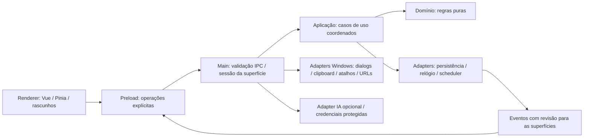

# Design

## Context

**TFA-001; artefatos aprovados em 2026-10-03, sem implementação.** Aprovação humana, conclusão do apply documental e archive estão registrados no [roadmap](C:/QSI/Workspaces/taskflow-app/docs/roadmap.md). Motivação e limites gerais: [proposal.md](C:/QSI/Workspaces/taskflow-app/openspec/changes/archive/2026-10-03-definir-arquitetura-e-paridade-desktop/proposal.md). Esta Change consolidou documentação; os contratos abaixo orientam Changes futuras, sem disponibilizar funcionalidades desktop.

O app tem Git próprio, roadmap, instruções e OpenSpec, mas ainda não tem package.json, aplicação, dependências ou gates de código. TFA-001 não tem dependências. A CLI local 1.14.0 resolve `C:\QSI\Workspaces\taskflow-app`, schema `spec-driven`, sem specs consolidadas e sem outras Changes.

Origem somente leitura: `C:\QSI\Workspaces\taskflow-extension`, HEAD observado `a763e7a0d646c664ecd4f979528bc2c3589fa8c4`. Base funcional: [README](C:/QSI/Workspaces/taskflow-extension/README.md), [arquitetura](C:/QSI/Workspaces/taskflow-extension/docs/architecture.md), código, specs e testes. Nenhum teste/build foi executado na origem; inspeção não comprova execução desktop.

### Evidências estruturais

| Referência na origem | Constatação e consequência |
| --- | --- |
| [package.json](C:/QSI/Workspaces/taskflow-extension/package.json), [tsconfig.json](C:/QSI/Workspaces/taskflow-extension/tsconfig.json) | Vue 3, Pinia, WXT/MV3 e TypeScript estrito. Configuração TypeScript depende da configuração gerada pelo WXT; scripts de build/postinstall são da extensão. Não copiar o scaffold para desktop. |
| [teste de fronteiras](C:/QSI/Workspaces/taskflow-extension/tests/architecture/layer-boundaries.test.ts) | Domínio/aplicação vedam Vue, Pinia, WXT, infraestrutura, Chrome e fetch. Portabilidade já é uma propriedade explícita, a preservar acrescentando Electron/Node às restrições futuras. |
| [TaskForm](C:/QSI/Workspaces/taskflow-extension/src/components/tasks/TaskForm.vue), [TaskList](C:/QSI/Workspaces/taskflow-extension/src/components/tasks/TaskList.vue), [TaskFilters](C:/QSI/Workspaces/taskflow-extension/src/components/tasks/TaskFilters.vue), [ConfirmDialog](C:/QSI/Workspaces/taskflow-extension/src/components/ConfirmDialog.vue) | Componentes Vue/CSS próprios, controles HTML e comportamentos específicos de foco, blur, Escape e confirmação. Quasar não é dependência existente. Migrar para componentes Quasar exige demonstrar equivalência. |
| [captura pendente, linha 24](C:/QSI/Workspaces/taskflow-extension/src/components/capture/use-pending-capture.ts:24) | `browser.windows.getCurrent()` dentro do composable identifica a janela Chrome. Substituir por identidade de superfície fornecida pelo adapter; não criar emulação global de Chrome. |
| [TaskRepository](C:/QSI/Workspaces/taskflow-extension/src/application/task-repository.ts), [TaskTrashRepository](C:/QSI/Workspaces/taskflow-extension/src/application/task-trash-repository.ts) | Repositories contêm callbacks de atualização condicional, subscriptions e erros de classe. São portas internas do processo, não contratos clonáveis para IPC. |
| [fila do repository, linha 307](C:/QSI/Workspaces/taskflow-extension/src/infrastructure/chrome/chrome-task-repository.ts:307), [composição tarefas](C:/QSI/Workspaces/taskflow-extension/src/composition/chrome-task-service.ts), [backup](C:/QSI/Workspaces/taskflow-extension/src/composition/chrome-backup-service.ts), [lembretes](C:/QSI/Workspaces/taskflow-extension/src/composition/chrome-reminder-service.ts) | Fila por instância. Tarefas/lixeira compartilham uma instância na superfície, mas backup e lembretes criam outras. No desktop, coordenar toda operação read/decide/commit no main; copiar só a fila de gravação não evita decisões sobre estado antigo. |
| [TaskService, linha 135](C:/QSI/Workspaces/taskflow-extension/src/application/task-service.ts:135) | Fechamento da ocorrência e geração da próxima usam `saveMany`; adapter desktop deve preservar tudo ou nada. |
| [BackupSource, linha 20](C:/QSI/Workspaces/taskflow-extension/src/application/backup/backup-service.ts:20) | Fonte tem `text()` e prévia contém tarefas. Main deve selecionar/ler arquivos e manter a preparação; renderer recebe resumo e token, não função File nem caminho arbitrário. |
| [verificação de backup, linha 102](C:/QSI/Workspaces/taskflow-extension/src/application/backup/backup-service.ts:102) | `sameTask` não compara subtarefas, recurrence ou seriesId, embora o formato atual os transporte. Registrar regressão para TFA-007; não preservar esta lacuna como regra de paridade nem corrigir a origem. |
| [manifesto](C:/QSI/Workspaces/taskflow-extension/wxt.config.ts), [spec de ícones](C:/QSI/Workspaces/taskflow-extension/openspec/specs/extension-icons/spec.md) | Spec de ícones ainda menciona conjunto antigo de permissões; manifesto atual inclui contextMenus/activeTab e host permissions opcionais. O inventário Chrome usa código atual, registrando a divergência. |

## Goals / Non-Goals

**Goals:** documentar fronteiras que conservem regras portáveis, decisões revisáveis e critérios observáveis; rastrear os 14 conjuntos funcionais ao código/spec/teste e à Change responsável; separar regras preservadas, adaptações já aceitas, recomendações e decisões futuras.

**Non-Goals:** desenvolver arquitetura executável, importar dados, copiar código/testes, instalar ferramentas ou antecipar gates ausentes. Não elaborar proposals/designs/tasks das TFA-002 a TFA-012. As descrições dessas Changes abaixo são destinos no roadmap, não autorização de execução.

## Decisions

### D1 — Stack proposto: Vue existente com Electron

| Critério | Vue 3/Pinia + Electron | Quasar + Electron |
| --- | --- | --- |
| Reaproveitamento | Domínio, aplicação, componentes e CSS revisados; substituir composição/adapters WXT | Domínio/aplicação reutilizáveis; componentes Vue podem coexistir, mas converter para Q-components aumenta o trabalho |
| Paridade visual/teclado | Mantém controles e foco observados com adaptação de superfície | Exige verificar comportamentos dos novos controles, dialogs, estilos e resets |
| Tooling | Escolher e configurar build de main/preload/renderer e empacotamento | CLI integra modo Electron e opções de bundler/empacotamento; ainda exige projetar IPC, armazenamento e segurança |
| Manutenção | Menos camada nova para a base atual; responsabilidade explícita pelo shell | Convenções/componentes adicionais podem ajudar se houver benefício concreto além desta migração |
| Custo Windows | Electron e instalador precisam de provas reais | Mesmas provas de Electron/instalador; Quasar não elimina essa obrigação |

**Baseline aprovado:** preservar Vue/Pinia e adotar Electron. O ganho é conservar uma interface já testada e trocar a infraestrutura de plataforma. Não houve benchmark de tamanho, consumo ou velocidade; não se afirma vantagem medida nesses pontos.

Quasar é alternativa válida, sem justificar reescrita agora. Uma futura adoção ou mudança do stack aprovado precisa de benefício demonstrável, revisão de paridade e revisão deste baseline antes de implementar a alteração.

**Tooling candidato, sem seleção de versões/pacotes nesta Change:** electron-vite para organizar três builds e electron-builder para NSIS. TFA-002 deve confirmar combinação de Electron/Node/TypeScript/Vite/Vitest, licença, manutenção e binários antes de instalar. Não herdar automaticamente as versões recentes do package.json da extensão nem executar seu postinstall.

Referências oficiais consultadas em 2026-10-03: [electron-vite](https://electron-vite.org/guide/), [Quasar Electron](https://quasar.dev/quasar-cli-vite/developing-electron-apps/configuring-electron/). A integração de tooling do Quasar não é evidência de ganho funcional para este código.

### D2 — Fronteiras propostas e ownership

- **Domínio:** Task, validação, status, consultas, recorrência, subtarefas, lembretes, trash/undo e normalização de captura; nenhum import Vue, Pinia, Electron, Node/fs ou rede.
- **Aplicação:** casos de uso e portas internas; executa no main quando altera estado durável, prepara/desfaz operações ou coordena lembretes. Relógio, IDs, repository, scheduler, notifier e provider entram por injeção.
- **Main:** composition root única; escritor e sessões das superfícies; ordena operações mutáveis incluindo backup e claims de lembretes. Mantém tokens transitórios e recursos do sistema. Chamadas HTTP não devem manter uma transação/fila de armazenamento bloqueada durante 30 segundos: preparar o snapshot rapidamente, executar rede fora do lock e validar sessão/configuração ao concluir.
- **Preload:** bridge mínima, tipada, com wrappers específicos e subscriptions que retornam unsubscribe. Não expõe ipcRenderer, Electron, eventos brutos, send(channel), require, fetch arbitrário ou fs. Validação no main é obrigatória mesmo com TypeScript/preload.
- **Renderer:** exibição, formulários e estado transitório por superfície; Pinia reflete snapshots/revisões do main e não grava diretamente. Pode usar regras puras para feedback antecipado, mas main valida novamente. Credencial existente nunca é devolvida na leitura de configuração.

Portas Chrome são substituídas por adapters desktop: repository, scheduler/notifier, abertura/foco de gerenciamento, reader/configurador de atalhos, inbox de captura, autorização por origem de IA e provedores. Captura de aba/menu Chrome é removida; o caso desktop recebe texto copiado sob comando explícito.

Alternativa rejeitada: cada renderer compor os próprios serviços/repositories. Isso multiplica escritores e autoridade de sistema e torna a coordenação de backup, undo e lembretes menos verificável.

### D3 — IPC de casos de uso, sem transporte de repositories

O desenho abaixo é um inventário lógico para as futuras Changes. Os nomes exatos serão definidos nelas; o preload só deve expor operações implementadas e necessárias, sem habilitar antecipadamente recursos futuros.

| Grupo / destino | Dados que cruzam IPC | Dados mantidos no main |
| --- | --- | --- |
| Tarefas / TFA-003, 004, 005 | Comandos explícitos criar/editar/status/subtarefa; ID, draft validado e revisão esperada quando aplicável; resultados DTO; snapshots e revisão | Repository, callbacks condicionais, transação e coordenação de recorrência |
| Lixeira/undo / TFA-006 | IDs, confirmação para ações destrutivas e token opaco de undo vinculado à superfície | Plano anterior e pré-condições; não aceitar Task/UndoPlan arbitrário enviado pelo renderer para restaurar |
| Backup / TFA-007 | Comandos selecionar/exportar/preparar/confirmar/cancelar; resumo validado e token | Dialogs, caminho escolhido, leitura limitada, tarefas preparadas e estado base da prévia |
| Ciclo de vida / TFA-008 | Comandos abrir/focar/encerrar e preferências; estado observável | Scheduler, claims, notifications, bandeja e lock de instância |
| Captura/atalhos / TFA-009 | Ação explícita de capturar, rascunho normalizado, combinações solicitadas/efetivas e falhas | Leitura pontual do clipboard, registro global e roteamento para superfície conhecida |
| IA / TFA-010 | Configuração sem segredo existente; novo segredo apenas no comando de gravação; prévia, origem, requestId/token, consentimento, cancelamento, sugestões validadas | Credenciais, HTTP, AbortController, snapshot exato da requisição/configuração e autorização |
| URLs externas / TFA-004 | Solicitação de abrir URL http/https validada e originada por ação do usuário | Parse final, allowlist de esquema e shell; nenhum protocolo de sistema/arquivo aceito |

Requisitos para refinar e testar na TFA-003:

1. `nodeIntegration: false`, `contextIsolation: true`, sandbox e webSecurity ativos; conteúdo do renderer empacotado localmente, CSP restritiva e nenhuma execução de HTML/script vindo de tarefas, clipboard ou IA. Rede de provedores fica no main.
2. Preferir protocolo local próprio com resolução limitada a assets empacotados; rejeitar traversal. Validar remetente por WebContents/sessão registrados, frame autorizado e origem local exata. Em dev, autorização deve ser específica ao servidor configurado, nunca wildcard para produção.
3. Validar schemas, limites e enumerações em runtime, com resultados de erro fechados e mensagens seguras. Não enviar cause/stack, caminhos sensíveis ou instâncias de Error esperando conservar prototype/instanceof no renderer.
4. Bloquear navegação externa, janelas arbitrárias e webviews; negar permissões não necessárias. Abrir apenas URLs http/https parseadas pelo adapter, após ação explícita. Política de credenciais em URL deve ser restrita na fronteira desktop e revisada se afetar conteúdo legado; não aceitar `file:`, `javascript:` ou protocolos do SO.
5. Tokens e cancelamentos pertencem à superfície/requestId; invalidar ao consumir, cancelar ou encerrar a sessão. Definir validade explícita na Change responsável. Não reutilizar token de outra janela ou contexto.
6. Eventos de estado e respostas carregam revisão para impedir que uma resposta atrasada substitua snapshot mais recente. Não transportar callbacks, File.text(), AbortSignal ou subscriptions pelo structured clone; reconstruir funções e abort controllers internamente.

A bridge e seu guard de runtime precisam cobrir o mesmo catálogo. Tipos não autorizam ações nem validam dados recebidos. Referência: [segurança Electron](https://www.electronjs.org/docs/latest/tutorial/security).

### D4 — Persistência: escritor único e unidade de trabalho

**Invariante proposta:** um processo main controla o perfil de dados e serializa read/decide/commit de mutações relacionadas. Transação abrange tarefas/lixeira, fechar/gerar ocorrência, restore e undo quando necessário; falha não deixa metade da operação. A fila deve se recuperar depois de erro.

| Opção | Benefício | Custo/condição |
| --- | --- | --- |
| SQLite transacional | Unidades de trabalho e atualizações condicionais naturais; migrações e consistência entre coleções | Driver, ABI/build e binários para arquiteturas Windows; configuração de durabilidade/journal, recovery e erros precisa ser verificada no pacote |
| JSON versionado em envelope único | Poucas dependências; formato legível e próximo dos codecs atuais | Precisa implementar temporário no mesmo volume, flush/substituição/recuperação; regravar coleção; tarefas e lixeira devem compartilhar commit e escritor; não basta writeFile nem atomicidade isolada de cada arquivo |

**Preferência:** SQLite, condicionada à seleção/prova específica na TFA-003 e a um caminho de empacotamento viável identificado na TFA-002. O driver e suas versões não são decididos agora. JSON é alternativa se o custo nativo não se justificar, com os mesmos invariantes/testes. Uma eventual mudança de mecanismo requer revisão da decisão antes de implementar, sem relaxar durabilidade ou isolamento.

Dados ficam no perfil do usuário, separados da instalação e da extensão. Schema de armazenamento e formato de backup são contratos separados: backup v4 não obriga banco desktop a usar schemaVersion 4. Abrir versões futuras/corrompidas deve bloquear escritas e oferecer recuperação explícita, sem resetar/sobrescrever silenciosamente. Migrações precisam de estratégia de reversão preservando dados; downgrades incompatíveis falham com segurança.

Um processo único não elimina rascunhos antigos: TFA-003 deve definir revisão esperada/conflito e TFA-004 preservar draft e feedback em caso de edição concorrente. A proposta é detectar conflitos de edições completas; toggles condicionais continuam aplicados ao dado mais recente, conservando mudanças de outros campos. Revisões de usuário e processamento interno de lembrete não devem invalidar undo de forma contrária à origem; não usar timestamp de milissegundo como garantia universal de ordem.

Abertura da persistência deve ocorrer sob ownership de instância única. A fundação TFA-002 precisa registrar essa fronteira para TFA-003; bandeja, roteamento de segunda instância e ciclo de vida completo pertencem à TFA-008. Backup preparado deve conferir o estado base antes da substituição: se mudou após a prévia, exigir nova prévia/confirmação, não apagar silenciosamente alterações recém-chegadas.

Referências: [transações SQLite](https://www.sqlite.org/transactional.html), [módulos nativos Electron](https://www.electronjs.org/docs/latest/tutorial/using-native-node-modules), [lock de instância Electron](https://www.electronjs.org/docs/latest/api/app#apprequestsingleinstancelockadditionaldata).

### D5 — Inventário de paridade e adaptações

Todos os itens abaixo são **observados na origem** e **planejados para o app**, sem alegação de disponibilidade. `P` = preservar regra; `A` = adaptar plataforma; `R` = revisar diferença/prova específica. Testes são candidatos para cópia revisada na Change responsável, nunca executados na origem.

| ID / fonte primária na origem | Regra e evidência a preservar | Desktop / destino / verificação futura |
| --- | --- | --- |
| P01 [task-management](C:/QSI/Workspaces/taskflow-extension/openspec/specs/task-management/spec.md) | UUID; título obrigatório trim até 200, descrição até 4000, pessoas até 120, até 10 tags de 30 distintas sem diferenciar caixa; URL http/https; TODO/IN_PROGRESS/DONE/CANCELLED e prioridade; completedAt somente DONE. Pesquisa título/descrição/pessoas/tags/subtarefas; filtros AND; ordenações e desempates; atrasada ativa, próxima em até 24h; UTC persistido/local na UI | P/A — TFA-003/004. [task-draft.test](C:/QSI/Workspaces/taskflow-extension/tests/domain/task-draft.test.ts), [task-queries.test](C:/QSI/Workspaces/taskflow-extension/tests/domain/task-queries.test.ts), [TaskManager.test](C:/QSI/Workspaces/taskflow-extension/tests/components/tasks/TaskManager.test.ts). Conflito entre edições completas será diferença explícita para revisão. |
| P02 [task-recurrence](C:/QSI/Workspaces/taskflow-extension/openspec/specs/task-recurrence/spec.md) | Diária/semanal/mensal, intervalos e limite inclusivo; âncora e horário civil local/DST; fim de mês retorna ao dia original quando possível; saltar passado sem gerar backlog. Fechar/pular gera uma nova ocorrência TODO com IDs novos; cancelar oferece pular/encerrar; reabrir não gera; uma ocorrência portadora da regra por série, sem proibir reabrir outra antiga | P — TFA-005. [recurrence.test](C:/QSI/Workspaces/taskflow-extension/tests/domain/task-recurrence.test.ts), [task-service.test](C:/QSI/Workspaces/taskflow-extension/tests/application/task-service.test.ts); fechamento + próxima atômicos, repetição/concorrência não duplicam. Integração reminder/undo refinada nas próprias Changes. |
| P03 [task-subtasks](C:/QSI/Workspaces/taskflow-extension/openspec/specs/task-subtasks/spec.md) | Até 20, título até 200, IDs únicos por tarefa, um nível, ordem manual/progresso derivado; estado independente do pai. Edição conserva marcações recentes das subtarefas existentes | P — TFA-005. [subtasks.test](C:/QSI/Workspaces/taskflow-extension/tests/domain/task-subtasks.test.ts), [TaskForm.test](C:/QSI/Workspaces/taskflow-extension/tests/components/tasks/TaskForm.test.ts); foco ao reordenar, toggles concorrentes e edição sem perda. |
| P04 [task-trash](C:/QSI/Workspaces/taskflow-extension/openspec/specs/task-trash/spec.md) | Retenção 30 dias, até 100 descartando mais antigas; exatamente no limite ainda retida, deletedAt futuro preservado. Move/restore atômicos; restore conserva ID, recusa colisão e trata lembretes vencidos; incompatibilidade bloqueia escrita; limpeza nos eventos previstos, sem cron novo | P/A — TFA-003/006. [trash.test](C:/QSI/Workspaces/taskflow-extension/tests/domain/task-trash.test.ts), [integração trash](C:/QSI/Workspaces/taskflow-extension/tests/integration/trash.test.ts). Backup não transporta/altera lixeira; excluir portadora da regra pausa continuidade até restore, sem nova ocorrência imediata. |
| P05 [task-undo](C:/QSI/Workspaces/taskflow-extension/openspec/specs/task-undo/spec.md) | Última edição/status/exclusão bem-sucedida, temporária por superfície, sem timer de expiração; pré-condições recusam concorrência inclusive ocorrência gerada alterada. Abrir formulário/backup/lixeira, ação posterior ou fechamento invalida conforme origem; não há undo de criação/toggle/restore/importação. Processar lembrete não deve bloquear undo por si só | P/A — TFA-006. [undo.test](C:/QSI/Workspaces/taskflow-extension/tests/domain/task-undo.test.ts), [TaskManager.test](C:/QSI/Workspaces/taskflow-extension/tests/components/tasks/TaskManager.test.ts). Main guarda plano com token; fechar para bandeja deve definir encerramento da sessão de undo, sem criar histórico persistente. |
| P06 [task-backup](C:/QSI/Workspaces/taskflow-extension/openspec/specs/task-backup/spec.md) | taskflow-backup v4; aceitar/migrar v1–v4; formato e schema de armazenamento separados; UTF-8, timestamp UTC, nome com hora local, 20 MiB antes de ler. Validação integral, IDs únicos, datas canônicas, prévia e confirmação; substituição total inclusive arquivo vazio. Futuro/inválido não altera local. Exporta tarefas, não trash/credenciais/undo | P/A/R — TFA-007. [fixtures](C:/QSI/Workspaces/taskflow-extension/tests/fixtures/backups/taskflow-backup-v4.json), [backup-file.test](C:/QSI/Workspaces/taskflow-extension/tests/application/backup-file.test.ts), [backup-service.test](C:/QSI/Workspaces/taskflow-extension/tests/application/backup-service.test.ts). Dialogs main; verificar todos os campos após restore, corrigindo a lacuna de sameTask no app. |
| P07 [task-reminders](C:/QSI/Workspaces/taskflow-extension/openspec/specs/task-reminders/spec.md) | Até 10, dueAt obrigatório; offsets inteiros não negativos ou AT até prazo; novos efetivos futuros e únicos; recorrência somente offsets. Ocorrência persistida como processedFor; consumir condicionalmente antes de notificar; máximo uma tentativa, não garantia de entrega. Reconcile de abertura descarta passados; tolerância de entrega 5min, distinta da tolerância de 1min de alarme obsoleto | P/A/R — TFA-008. [reminders.test](C:/QSI/Workspaces/taskflow-extension/tests/domain/task-reminders.test.ts), [reminder-service.test](C:/QSI/Workspaces/taskflow-extension/tests/application/reminder-service.test.ts); testes empacotados de suspend/resume/restart e mudança concorrente. Clique para abrir tarefa é adaptação nova a aceitar, não comportamento Chrome comprovado. |
| P08 [quick-add](C:/QSI/Workspaces/taskflow-extension/openspec/specs/quick-add/spec.md) | Entrada compacta título/prazo/pessoas/prioridade, foco inicial, sucesso limpa draft, falha conserva, abrir gerenciamento preserva estado; sem IA/trash/backup nessa superfície | P/A — TFA-004/009. [QuickAdd.test](C:/QSI/Workspaces/taskflow-extension/tests/components/quick-add/QuickAdd.test.ts). Janela pequena própria; sem impor largura fixa de popup Chrome à janela principal. |
| P09 [page-capture](C:/QSI/Workspaces/taskflow-extension/openspec/specs/page-capture/spec.md) | Origem tem botão de página e menu de seleção, título/url da aba e normalização/truncamento seguro; pendente identificada, TTL 10min antes da entrega, nova substitui anterior; durante edição não sobrescreve draft | A confirmada/R — TFA-009. [page-capture.test](C:/QSI/Workspaces/taskflow-extension/tests/domain/page-capture.test.ts), [pending-capture.test](C:/QSI/Workspaces/taskflow-extension/tests/components/capture/use-pending-capture.test.ts). Somente links/textos copiados por botão/atalho, leitura pontual. Sem metadata/title via rede. URL-only propõe sourceUrl e título vazio para revisão; texto usa normalização/limites existentes; comportamento final revisado na TFA-009. |
| P10 [keyboard-shortcuts](C:/QSI/Workspaces/taskflow-extension/openspec/specs/keyboard-shortcuts/spec.md) | Chrome sugere Ctrl+Shift+K/L para Quick Add/gerenciamento; UI informa combinação efetiva e indisponibilidade, não finge registro | A/R — TFA-009. [shortcuts.test](C:/QSI/Workspaces/taskflow-extension/tests/components/shortcuts/ShortcutsHint.test.ts). Registro global personalizável, conflitos com SO/apps e feedback; captura precisa combinação própria revisada, sem reutilizar ambos os atalhos já ocupados. |
| P11 [ai-providers](C:/QSI/Workspaces/taskflow-extension/openspec/specs/ai-providers/spec.md) | Um provider ativo OpenAI/Anthropic/CUSTOM compatível; HTTPS remoto, HTTP só loopback, base sem credenciais/query/fragment; modelo/segredo opcionais conforme provider. Probe 15s e eventual ping mínimo somente explícitos; bloqueio de redirect; sem rede automática | P/A/R — TFA-010. [ai-provider.test](C:/QSI/Workspaces/taskflow-extension/tests/domain/ai-provider.test.ts), [ai-adapters.test](C:/QSI/Workspaces/taskflow-extension/tests/infrastructure/ai-adapters.test.ts). Consentimento por origem no app substitui host permission Chrome. Credencial protegida no main, safeStorage/DPAPI candidato, sem plaintext como fallback automático. |
| P12 [ai-task-assistance](C:/QSI/Workspaces/taskflow-extension/openspec/specs/ai-task-assistance/spec.md) | Formulário com título/vagas; prévia exata do conteúdo, descrição enviada até 1000, instruções fixas; máximo 20 subtarefas e títulos validados/deduplicados. Uma requisição, saída limitada, timeout 30s, cancelar/fechar descarta; selecionar/editar sugestões altera draft, nunca salva automaticamente | P/A — TFA-010. [ai-suggestion-service.test](C:/QSI/Workspaces/taskflow-extension/tests/application/ai-subtask-suggestion-service.test.ts), [TaskFormAiSuggestion.test](C:/QSI/Workspaces/taskflow-extension/tests/components/tasks/TaskFormAiSuggestion.test.ts). Snapshot/preparação e requestId no main; não transmitir credencial em leitura nem conteúdo em logs; mocks sem chamadas pagas. |
| P13 [interface-accessibility](C:/QSI/Workspaces/taskflow-extension/openspec/specs/interface-accessibility/spec.md) | Hierarquia, rótulos/aria/feedback; contraste texto 4.5:1 e foco 3:1; dialog foco inicial cancelar, trap/Escape/restauração. Status por teclado com escolha pendente/confirmar/reverter, regra especial de cancelamento recorrente; foco após ações e erro inicial | P — TFA-004 a 012. [contrast.test](C:/QSI/Workspaces/taskflow-extension/tests/styles/contrast.test.ts), [ConfirmDialog.test](C:/QSI/Workspaces/taskflow-extension/tests/components/ConfirmDialog.test.ts), [TaskList.test](C:/QSI/Workspaces/taskflow-extension/tests/components/tasks/TaskList.test.ts). Validar também DPI/zoom/tabulação/leitor de tela Windows; não trocar controles sem equivalência. |
| P14 [extension-icons](C:/QSI/Workspaces/taskflow-extension/openspec/specs/extension-icons/spec.md) | Identidade check branco, fundo #5368e8, forma arredondada, sem calendário/IA; master SVG e variantes Chrome existentes | P/A/R — TFA-002/011/012. [icons.test](C:/QSI/Workspaces/taskflow-extension/tests/brand/extension-icons.test.ts). Derivar ícones Windows/tray/instalador revisados; não prometer que PNG de extensão satisfaz todos os usos desktop. Divergência das permissões registrada separadamente. |

Regras adicionais a transportar no baseline: migração v1 de processedAt para ocorrência processedFor, v2 para estrutura de recorrência e v3 para subtarefas, sem perder IDs/datas válidos; exportação usa appVersion desktop informativa. Restauração ajusta lembretes passados e reconcilia scheduler; falha só no scheduler após commit deve informar pendência, sem anunciar rollback de dados que já ocorreu.

#### Exclusividades Chrome e substituições

| Recurso atual | Tratamento desktop |
| --- | --- |
| WXT, Manifest V3, service worker e entrypoints popup/Side Panel | Não reutilizar scaffold; main/composição desktop e janelas locais |
| browser.storage.local / storage.onChanged | Repository main, persistência versionada e eventos com revisão |
| browser.alarms / notifications | Scheduler reconstruído de estado durável e Notification Windows |
| activeTab / tabs / contextMenus | Remover; clipboard sob ação explícita, sem inspeção de abas ou menu dentro do Chrome |
| browser.commands / chrome://extensions/shortcuts | Configuração de atalhos global dentro do app e verificação de registro |
| browser.windows, sidePanel e mensagens de captura | Identidade de superfície, foco/roteamento main e inbox temporária |
| runtime.getManifest / mensagens / optional host permissions | Metadata do app, IPC e autorização explícita por origem de IA |

### D6 — Lembretes e ciclo de vida: contrato e proposta a refinar

Fonte de verdade é a ocorrência persistida, não timer nem Notification. Reconciliar ao abrir e após alterações/restore; reconstruir timers a partir da projeção atual. Claim persistido precede chamada ao notifier; uma falha ou crash nesse intervalo pode perder aviso e não autoriza retry automático. Esta é a política de máximo uma tentativa da origem, não exactly-once no Windows.

| Evento | Proposta para TFA-008 / limite preservado |
| --- | --- |
| Minimizar / janela oculta | Processo e scheduler continuam se app permanecer em execução |
| Fechar janela | Recomendar ocultar na bandeja, com indicação clara e saída explícita; invalidar sessão temporária de undo/cancelar geração em curso. Retenção de outros drafts e aviso inicial serão revisados na TFA-008 |
| Sair | Encerra timers, callbacks, atalhos e processo após tratar writes pendentes; nenhum lembrete enquanto encerrado |
| Suspender e retomar com processo vivo | Revalidar contra estado atual; proposta de entregar ainda válido até 5min, depois consumir atrasados sem aviso. Ordem entre reconcile e entrega deve ser testada para não descartar antes a ocorrência elegível |
| Abrir novamente após saída/crash | Reconcile de abertura consome passados sem avisos retroativos, conforme origem, e programa futuros |
| Computador desligado / notificações bloqueadas | Não prometer avisos nem confirmação de leitura/entrega |
| Login | Preferência opcional, nunca obrigatória; decisão e default em TFA-008 |

Fechar para bandeja e abrir tarefa ao clicar na notificação são recomendações/adaptações sujeitas à revisão da TFA-008; aprovar documentação da TFA-001 não aprova sua implementação. Não adicionar serviço Windows nem scheduler externo. Referências: [powerMonitor](https://www.electronjs.org/docs/latest/api/power-monitor), [notificações](https://www.electronjs.org/docs/latest/tutorial/notifications).

### D7 — IA e credenciais

Conservar protocolos/validação portáveis e adapters HTTP revisados; executar rede e acesso a segredo no main. CUSTOM local continua permitido somente nos endereços loopback aceitos e remoto requer HTTPS. Consentimento deve vincular origem, configuração e preparação exata, não um booleano enviado por qualquer renderer. Mudança de provider/configuração ou fechamento/cancelamento invalida resultado pendente.

TFA-010 deve avaliar safeStorage/DPAPI na versão Electron fixada. Sem proteção disponível, proposta é bloquear gravação de segredo/uso que o exija, mantendo gerenciamento offline; não degradar silenciosamente para plaintext. Não afirmar proteção contra outros processos/malware do mesmo usuário. Renderer lê somente resumo; senha nova pode entrar pelo formulário e comando de escrita, sendo descartada do estado transitório depois. Segredo existente não retorna por IPC.

Prévia de geração deve ser preparada no main, vinculada à requisição exata e ao consentimento. Sugestões retornam validadas para revisão/seleção no draft. Cancelamento usa requestId escopado e AbortController local; resposta tardia é descartada, mesmo quando o transporte não puder interromper imediatamente. Limites de payload/resposta, timeout e bloqueio de redirects são preservados/verificados. Nenhuma conexão/probe/generation automática no startup, edição, save ou testes. Referência: [safeStorage](https://www.electronjs.org/docs/latest/api/safe-storage).

### D8 — Windows e identidade

Meta confirmada: instalador exclusivo por usuário, perfil próprio, sem administrador, serviço Windows ou Node/npm no destino. O app precisa funcionar offline no gerenciamento principal; IA só usa rede por ação do usuário. Atualização inicial manual por nova instalação, sem auto-update remoto.

**Candidato de instalador:** NSIS electron-builder, one-click com `perMachine: false`. O modo assistido pode oferecer escolha entre usuário/máquina; `perMachine: false` isolado não demonstra exclusividade per-user. Configuração final/asInvoker, paths, registro, atalhos, manutenção, update e uninstall exigem prova em conta padrão na TFA-002, repetida na TFA-011 com produto completo. Referência: [NSIS](https://www.electron.build/docs/nsis/).

TFA-002 precisa escolher o alvo inicial Windows/arquitetura, nome/appId estáveis e caminho de dados, antes de empacotar; TFA-011 finaliza assets, distribuição e assinatura sem trocar identidade e perder dados/notificações. Não inventar identificador de publisher/empresa. Notificações dependem também da identidade/atalho instalado: teste dev não basta.

Recomendar preservar dados na atualização e na desinstalação padrão, com exclusão explícita separada se futuramente aprovada; política final de uninstall pertence à TFA-011. Permissão para instalar por usuário não equivale à autorização corporativa para executar. Sem contorno de política, publicação, contratação de assinatura ou instalação em máquina corporativa nesta Change.

### D9 — OpenSpec mínimo

Configuração existente suficiente: raiz local `openspec/`, `schema: spec-driven` em `openspec/config.yaml` e skills geradas para Codex. Nenhuma inicialização adicional, pacote local, schema customizado, store ou criação das 12 Changes é necessária para esta proposta. Context/rules adicionais são opcionais; AGENTS e roadmap continuam as instruções do projeto, sem duplicação automática na configuração.

Nesta Change documental usar `skip_specs: true`; status deve mostrar proposal/design/tasks `done` e specs `skipped`. Não criar requisitos artificiais de runtime. Changes funcionais futuras criarão deltas conforme o comportamento aprovado; não importar todos os arquivos da extensão cegamente para `openspec/specs`.

Comandos efetivamente disponíveis: `openspec --version`, `context --json`, `list --json`, `list --specs --json`, `new change`, `status --change`, `instructions <artifact> --change` e `validate <change> --type change --strict --no-interactive`. OPSX é workflow de chat/skill, não CLI PowerShell. Status `done` de artefato significa arquivo presente, não aprovação ou implementação.

### D10 — Estratégia de testes e critérios documentais

**Aceitação da TFA-001 após apply documental autorizado:**

- AC01: arquitetura publicada em docs diferencia estado atual, recomendações aprovadas, decisões condicionais e destinos futuros; compara as duas alternativas e conserva local-first/Windows per-user.
- AC02: matriz contém P01–P14, fontes reais, tratamento P/A/R, Change responsável e verificação futura; inclui exclusividades Chrome e as duas divergências conhecidas, sem declarar paridade desktop executada.
- AC03: fronteiras mostram domain/application independentes, main escritor/coordenador e renderer isolado; catálogo IPC evita callbacks, fs irrestrito, segredos lidos e tokens entre superfícies.
- AC04: durabilidade, incompatibilidade, concorrência e conflitos de draft têm invariantes; SQLite/JSON têm alternativas e prova condicionada, sem implementação prematura.
- AC05: comportamento de backup é descrito corretamente: tarefas v1–v4, substituição total e exclusões; lembretes/undo/IA mantêm seus limites e adaptações pendentes identificadas.
- AC06: plano distingue testes portáveis, adapters desktop, integração entre janelas e provas no Windows instalado; não existe alegação de gate ausente executado.
- AC07: docs e metadata passam revisão de links/consistência e validação OpenSpec estrita; Git próprio e origem somente leitura; nenhuma cópia de código, dados, segredo ou scaffold.
- AC08: roadmap conserva IDs/dependências, status e data corretos; nenhuma aprovação/DONE/continuação automática. README só terá ajuste factual pertinente após archive autorizado, sem status de desenvolvimento nem recursos planejados como disponíveis.

**Plano futuro, não tarefas de implementação da TFA-001:**

| Nível / destino | Evidência esperada |
| --- | --- |
| Unitário portátil / TFA-004 a 010 | Copiar seletivamente e revisar testes domain/application, fixtures e fakes sem credenciais/dados reais. Cobrir limites/normalização, consultas, DST/fim de mês, subtarefas, trash/undo, migrações e cancelamento IA. Teste de fronteiras adaptado para vedar Electron/Node nos núcleos |
| Contrato de persistência / TFA-003 | Falha em cada etapa de commit, escrita interrompida, recovery/corrupção/schema futuro, migração, rollback e fila após erro; transações multi-entidade, concorrência entre janelas/backup/reminder; nenhuma perda silenciosa |
| IPC/preload / TFA-003 e extensões futuras | Remetente/frame inválido, token de outra sessão, payload inválido/grande, esquema URL proibido, traversal, evento/reply fora de ordem, cancelamento tardio; renderer sem Node/fs, CSP/bridge e erro seguro verificados |
| UI / TFA-004 a 010 | Reaproveitar testes de componentes/stores após adapters, preservar erro/draft/foco/teclado/contraste; confirmar operações via proxy. Teste DOM não prova integração de plataforma |
| Integração de dados / TFA-005 a 008 | Status recorrente concorrente gera uma próxima; undo não pisa edição; claims at-most-once; restore verifica inclusive recurrence/seriesId/subtasks; prévia stale exige reconfirmação |
| IA mockada / TFA-010 | Três providers, consentimento por origem/configuração, redirects/localhost, timeout/body limit, abort e fechamento, troca de provider, conteúdo exato da prévia; sem chamadas pagas ou segredo em logs/backup |
| Windows empacotado / TFA-002, 008, 009, 011, 012 | Conta padrão, sem Node/admin/serviço; instalação/update/uninstall e dados; ABI do driver; duas instâncias/janelas, suspend/resume/restart, notificações/clique/tray, atalhos ocupados, captura explícita, DPI/teclado/offline |

TFA-002 estabelece lint, typecheck, testes e build no app e CI correspondente. Depois usar esses gates em cada Change pertinente. Nesta TFA-001 eles não existem; única validação automática aplicável é OpenSpec, complementada pela revisão documental. Build/smoke renderer não comprova instalador, IPC, bandeja, notificações ou atalhos.

## Risks / Trade-offs

- [Reescrita visual por adoção de framework] → Preservar Vue/CSS/controles e só trocar mediante benefício demonstrado e revisão de teclado/foco.
- [Electron amplia autoridade de conteúdo] → Isolamento, sandbox, CSP, origem/remetente e catálogo IPC mínimos, sem conteúdo remoto executável.
- [Writes serializadas mas decisões antigas] → Coordenar read/decide/commit e revisões de draft; não copiar fila por instância como solução global.
- [Falha de arquivo/banco ou migração apaga dados] → Unidade atômica, recovery, versão futura sem write e testes de fault injection; backup separado da persistência.
- [Dependência nativa falha instalada] → Seleção e prova de ABI/empacotamento antes de consolidar driver; JSON mantém invariantes como alternativa revisada.
- [Prévia de backup/IA diverge da execução] → Preparações main, tokens por sessão/configuração, revalidação e consentimento; cancelamento/fechamento invalidam.
- [Aviso perdido entre claim e notifier] → Explicitar máximo uma tentativa, testar crash/falha e não prometer exactly-once ou aviso com app encerrado.
- [Ocultar janela deixa undo/IA vivos indevidamente] → Separar vida do processo, janela e sessão de interação; formalizar na TFA-006/008/010.
- [Origem evolui ou specs divergem do código] → Hash, fontes e desvios registrados; revalidar diferenças antes de cópia futura, sem alterar origem.
- [Instalador per-user bloqueado pela organização] → Prova em ambiente autorizado e registro da limitação, sem contorno; avaliação de assinatura não garante aceitação.
- [TFA-001 absorve implementação futura] → Tasks exclusivamente documentais; referências futuras não são autorização e o workflow para após propose.

## Migration Plan

1. Nesta etapa, criar somente artefatos da TFA-001 e atualizar roadmap para revisão. Não consolidar specs, publicar docs finais ou marcar tarefas executadas pela criação da proposta.
2. Após aprovação explícita e novo pedido de apply, publicar o baseline documental em docs/architecture.md, docs/parity-matrix.md e docs/test-strategy.md, preservando cada decisão condicionada/destino. Isso completa a implementação documental da TFA-001, sem scaffold.
3. Validar docs/OpenSpec e solicitar a revisão de implementação conforme o fluxo autorizado. Archive, specs consolidadas (nenhuma delta nesta Change), ajuste factual do README, commits/PR e integração seguem o fluxo AGENTS; sem aprovação não arquivar ou marcar DONE.
4. Em sessões futuras, TFA-002 prova fundação/instalador e as demais Changes implementam seus contratos aprovados. Copiar só arquivos selecionados da origem, revisados, nunca .git/.env/node_modules/build/dados/configuração pessoal. Não executar ferramentas que escrevam nela.
5. Migração do usuário, apenas quando TFA-007 existir: exportar tarefas com o recurso atual da extensão e importar arquivo no app mediante prévia/substituição confirmada. Não acessar automaticamente o perfil Chrome. Lixeira, credenciais e undo não migram nesse arquivo.

Rollback da TFA-001 é documental: revisar/reverter somente alterações próprias no Git do app, preservando trabalho preexistente. Não existe banco, instalação ou dado de usuário a reverter nesta Change. Rollback de migração/instalador será definido nas respectivas propostas, sem presumir que binário antigo lê schema futuro.

## Open Questions

Estas questões não impedem as três entregas documentais nem alteram seu escopo. Nenhuma será resolvida por implementação na TFA-001; são gates explícitos antes do ponto correspondente das futuras Changes.

| Questão / decisão pendente | Responsável e momento de revisão |
| --- | --- |
| Versões compatíveis do tooling; alvo Windows inicial/x64/ARM64; nome/appId/pasta próprios; prova inicial do driver candidato | TFA-002 antes de scaffold/primeiro instalador; TFA-011 amplia/finaliza distribuição. Não criar identidade de publisher por inferência |
| Driver/configuração SQLite, unidades de trabalho, revisão esperada e política de recovery; alternativa JSON se necessário | TFA-003 antes do adapter. Preferência por SQLite documentada, não seleção de pacote nesta Change |
| UX de conflito de formulário e revisão sem perder draft | TFA-003/004; adaptar UI ao contrato aprovado, sem aceitar last-write-wins silencioso |
| Fechar para bandeja, tratamento de drafts/undo, retomada dentro da tolerância, login opcional e clique da notificação | TFA-006/008; política de saída completa e startup sem retroativos já está explícita, recomendações restantes exigem revisão |
| Título de URL-only, associação de origem ao texto e terceira combinação global/defaults | TFA-009; captura por botão/atalho sem polling/rede já confirmada; opções concretas submetidas à revisão própria |
| API de proteção de segredo disponível na versão fixada, consentimento por origem e experiência quando indisponível | TFA-010; renderer não lê segredo e plaintext não é fallback automático |
| Assinatura/canal manual, retenção no uninstall e ambientes corporativos autorizados para validação | TFA-011/012; sem contratação/publicação/instalação por este documento |

O registro dessas pendências permite revisar um baseline documental completo agora; não transfere ao futuro a investigação genérica já realizada nem afirma que o produto está pronto.
